# Uruchomienie servera ms sql

## Linki


- [MS SQL 2022](https://www.microsoft.com/pl-pl/sql-server/sql-server-downloads)
- [SSMS (graficzny interfejs do bazy danych)](https://learn.microsoft.com/en-us/sql/ssms/download-sql-server-management-studio-ssms?view=sql-server-ver16#download-ssms)

---

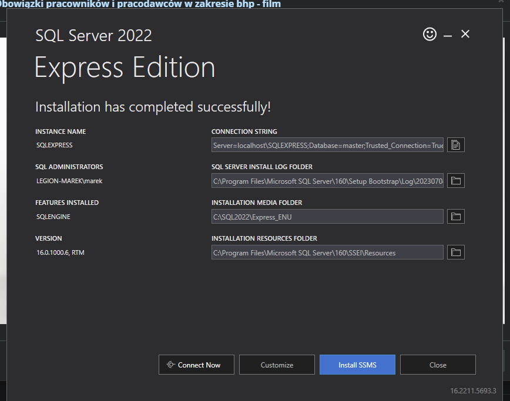

Connection string: `Server=localhost\SQLEXPRESS;Database=master;Trusted_Connection=True;`

LOG folder: `C:\Program Files\Microsoft SQL Server\160\Setup Bootstrap\Log\20230704_085153`

Miejsce zainstalowania media: `C:\SQL2022\Express_ENU`

Miejsce zainstalowania zasobów: `C:\Program Files\Microsoft SQL Server\160\SSEI\Resources`

---

## Konfiguracja

### Podłączenie się do bazy danych

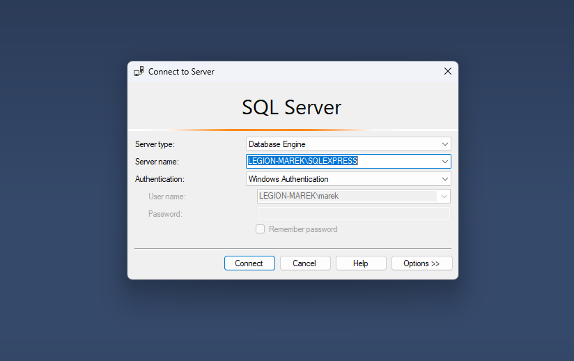

### Utworzenie nowej bazy danych

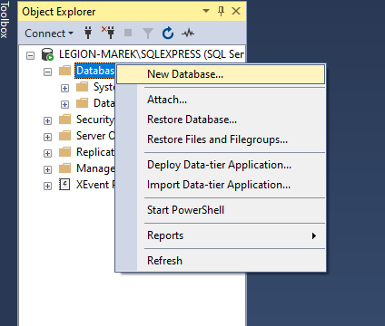

### Utworzenie nowej tabeli (skip)

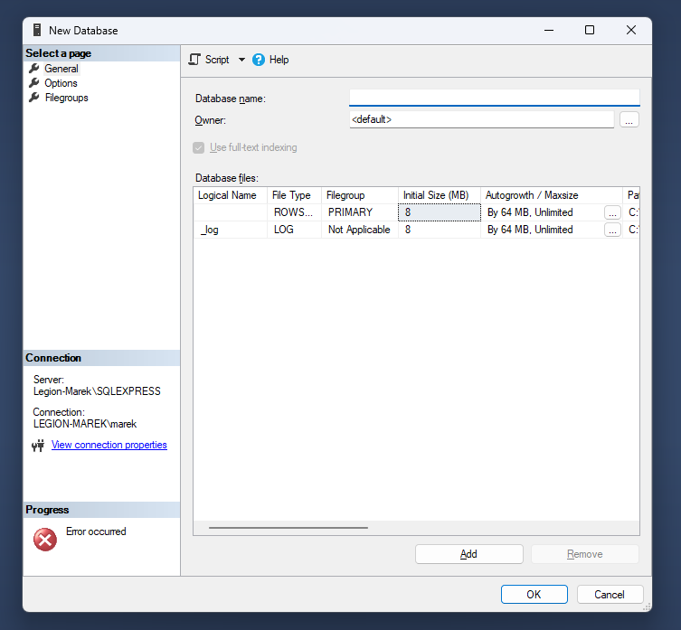

### Utworzenie skryptu do backupu

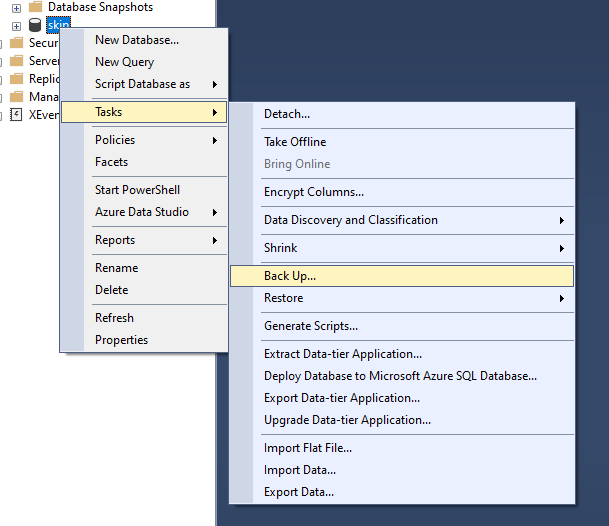

Po kliknięciu na przycisk `Script` wyświetli się okno z kodem do backupu bazy danych.
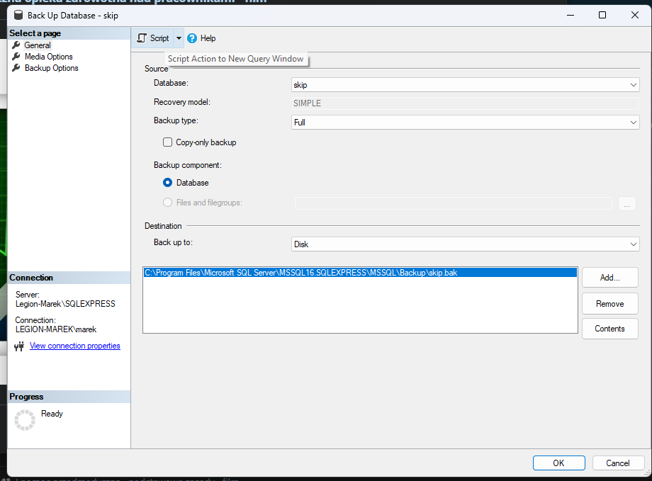

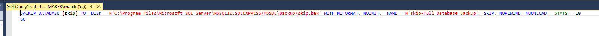

### Należy to zapisać do pliku .sql a następnie dodać do harmonogramu zadań

```sql
BACKUP DATABASE [skip] TO  DISK = N'<path>' WITH NOFORMAT, NOINIT,  NAME = N'skip-Full Database Backup', SKIP, NOREWIND, NOUNLOAD,  STATS = 10
GO
```

Panel Sterowania -> System i zabezpieczenia -> Zaplanowane zadania
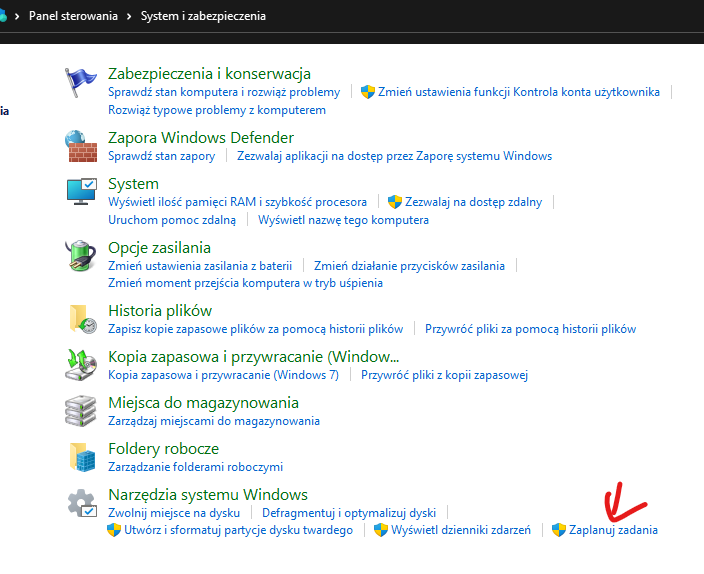

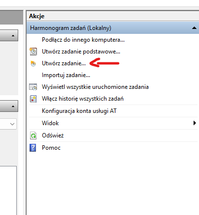

Nadanie nazwy
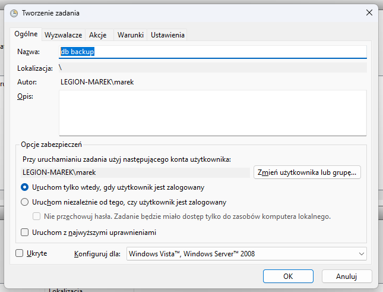

Przejście do wyzwalaczy
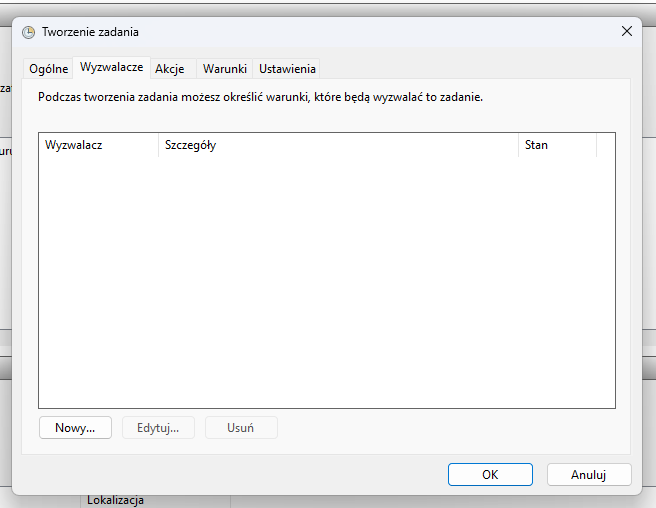

Kliknij Nowy
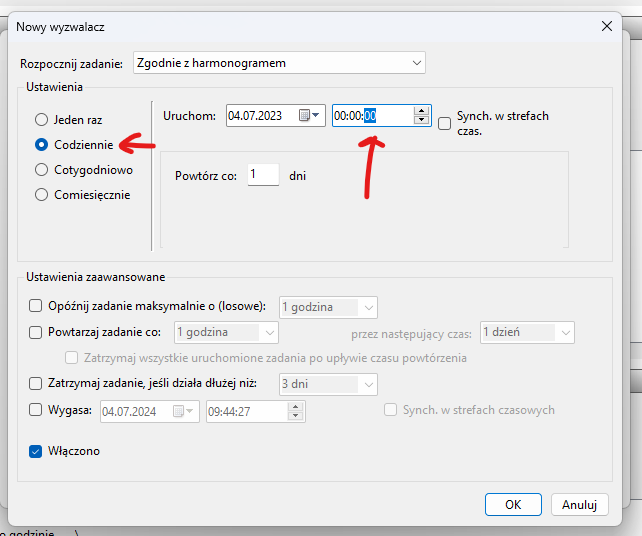

Akcje -> Nowa


Argumenty

-S Legion-Marek\SQLEXPRESS  -i C:\Users\marek\Documents\backup.sql

Po kliknięciu uruchom zadanie powinno się wykonać a data powinna się zmienić na aktualną
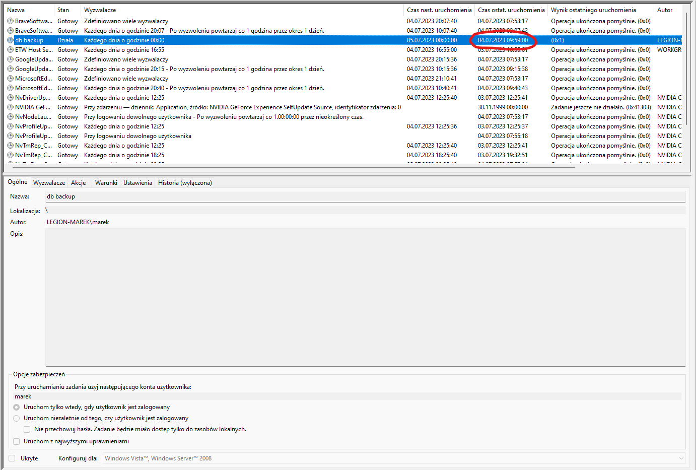
A w folderze powinien pojawić się plik backupu
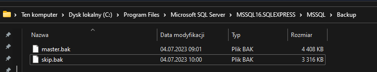

---

## Dodanie kopiowania na network share

Ponownie dodaj zadanie

Uzupełnij je skryptem powershell z tego repozytorium

```powershell
$sourceFile = "C:\Path\to\source\file.txt"
$networkShare = "\\Server\Share"

$destinationFileName = "file.txt"

$destinationPath = Join-Path -Path $networkShare -ChildPath $destinationFileName

Copy-Item -Path $sourceFile -Destination $destinationPath -Force

if (Test-Path -Path $destinationPath) {
    Write-Host "Successfully copied to $destinationPath"

    Remove-Item -Path $sourceFile -Force
    Write-Host "Source file deleted: $sourceFile"
} else {
    Write-Host "Failed to copy to $destinationPath"
}
```

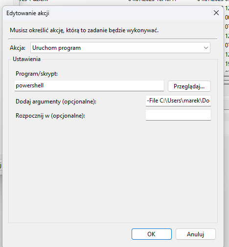

Po kliknięciu uruchom zadanie powinno się wykonać a plik pojawić się na udziale sieciowym
