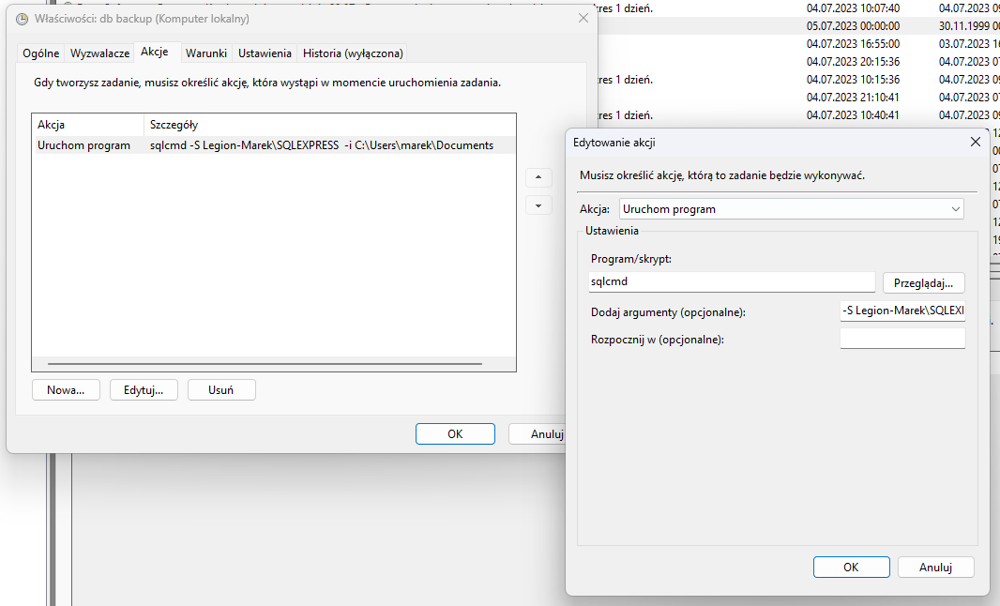

# Uruchomienie servera ms sql

## Linki


- [MS SQL 2022](https://www.microsoft.com/pl-pl/sql-server/sql-server-downloads)
- [SSMS (graficzny interfejs do bazy danych)](https://learn.microsoft.com/en-us/sql/ssms/download-sql-server-management-studio-ssms?view=sql-server-ver16#download-ssms)

---


Connection string: `Server=localhost\SQLEXPRESS;Database=master;Trusted_Connection=True;`

LOG folder: `C:\Program Files\Microsoft SQL Server\160\Setup Bootstrap\Log\20230704_085153`

Miejsce zainstalowania media: `C:\SQL2022\Express_ENU`

Miejsce zainstalowania zasobów: `C:\Program Files\Microsoft SQL Server\160\SSEI\Resources`

---

## Konfiguracja

### Podłączenie się do bazy danych


### Utworzenie nowej bazy danych


### Utworzenie nowej tabeli (skip)


### Utworzenie skryptu do backupu


Po kliknięciu na przycisk `Script` wyświetli się okno z kodem do backupu bazy danych.


### Należy to zapisać do pliku .sql a następnie dodać do harmonogramu zadań

```sql
BACKUP DATABASE [skip1] TO  DISK = N'<path>' WITH NOFORMAT, NOINIT,  NAME = N'skip-Full Database Backup', SKIP, NOREWIND, NOUNLOAD,  STATS = 10
BACKUP DATABASE [skip2] TO  DISK = N'<path>' WITH NOFORMAT, NOINIT,  NAME = N'skip-Full Database Backup', SKIP, NOREWIND, NOUNLOAD,  STATS = 10
GO
```

Panel Sterowania -> System i zabezpieczenia -> Zaplanowane zadania


Nadanie nazwy


Przejście do wyzwalaczy


Kliknij Nowy


Akcje -> Nowa


Argumenty

-S Legion-Marek\SQLEXPRESS  -i C:\Users\marek\Documents\backup.sql

Po kliknięciu uruchom zadanie powinno się wykonać a data powinna się zmienić na aktualną

A w folderze powinien pojawić się plik backupu


---

## Dodanie kopiowania na network share

Ponownie dodaj zadanie

Uzupełnij je skryptem powershell z tego repozytorium

```powershell
$sourceDirectory = "path"
$networkShare = "path"
$logFilePath = "path\backup_log.txt"

$currentDate = Get-Date -Format "dd-MM-yyyy_hh-mm-ss"
$destinationFolder = Join-Path -Path $networkShare -ChildPath "Backups\$currentDate"

if (!(Test-Path -Path $destinationFolder)) {
    New-Item -Path $destinationFolder -ItemType Directory | Out-Null
}

Get-ChildItem -Path "$networkShare\Backups\" -Recurse -Directory | Where-Object {($_.LastWriteTime -lt (Get-Date).AddDays(-7))} | Remove-Item -Force -Recurse


$sourceFiles = Get-ChildItem -Path $sourceDirectory -Filter "*.bak" -File
$filesInDestination = Get-ChildItem -Path $destinationFolder -Filter "*.bak" -File

$logMessage = "Backuping files ($currentDate): `n"


foreach ($sourceFile in $sourceFiles) {
    $destinationFileName = $sourceFile.Name -replace '\.bak$', "_$currentDate.bak"
    $destinationPath = Join-Path -Path $destinationFolder -ChildPath $destinationFileName

    Copy-Item -Path $sourceFile.FullName -Destination $destinationPath -Force

    if (Test-Path -Path $destinationPath) {
        Write-Host "Successfully copied to $destinationPath"

        Remove-Item -Path $sourceFile.FullName -Force
        Write-Host "Source file deleted: $($sourceFile.FullName)"
        $logMessage += "File: $($sourceFile.FullName) - Sent to: $destinationPath`n"
    } else {
        Write-Host "Failed to copy to $destinationPath"
        return
    }
}
if ($sourceFiles.Count -gt 0) {
    Write-Host "Removing old files from $destinationFolder"
    foreach ($fileInDestination in $filesInDestination) {
        Remove-Item -Path $fileInDestination.FullName -Force
    }
}

$logMessage += "----------------------------------------`n"

Add-Content -Path $logFilePath -Value $logMessage


# $oldFolders = Get-ChildItem -Path $networkShare | Where-Object {
#     $_.PSIsContainer -and $_.Name -match '^\d{2}-\d{2}-\d{4}_\d{2}-\d{2}-\d{2}' -and $_.LastWriteTime -lt (Get-Date).AddDays(-1)
# }
# Write-Host $oldFolders.Count
# foreach ($oldFolder in $oldFolders) {
#     Remove-Item -Path $oldFolder.FullName -Recurse -Force
#     Write-Host "Deleted folder: $($oldFolder.FullName)"
# }


```


Po kliknięciu uruchom zadanie powinno się wykonać a plik pojawić się na udziale sieciowym
